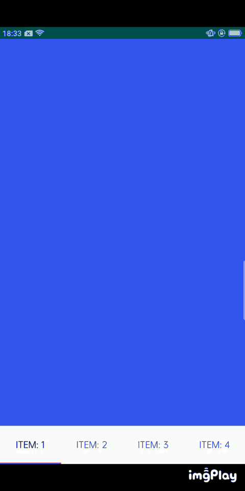

# 实现ViewPager+Fragment懒加载的另一个套路

## 前言

我们实现`ViewPager`+`Fragment`懒加载，通常是处理`Fragment`来控制。先给一个预加载`View`，通常是类似`ProgressBar`的`View`组合，当`ViewPager`滑动到当前`Fragment`时移除预加载`View`，加载业务`View`

这样通常会修改`Fragment`的结构，这里我想到了另一个方法，不修改`Fragment`，而是去修改`FragmentPagerAdapter`

项目地址：[LazyPagerAdapter](https://github.com/MycroftWong/LazyPagerAdapter)

引用 `implementation 'com.github.MycroftWong:LazyPagerAdapter:v1.0'`

## 实现

首先构造一个占位`ViewGroup`, 其中包含一个预加载`View`, 当滑动到当前`ViewPager`时，移除预加载的`View`，再添加`Fragment`

```java
import android.view.LayoutInflater;
import android.view.View;
import android.view.ViewGroup;

import androidx.annotation.LayoutRes;
import androidx.annotation.NonNull;
import androidx.fragment.app.Fragment;
import androidx.fragment.app.FragmentManager;
import androidx.fragment.app.FragmentTransaction;
import androidx.viewpager.widget.PagerAdapter;

import java.util.ArrayList;
import java.util.List;

/**
 * 想完成的功能，Fragment 不用特意去实现懒加载，完全在 PagerAdapter 中处理懒加载
 *
 * @author wangqiang
 */
public abstract class LazyPagerAdapter extends PagerAdapter {

    private final FragmentManager mFragmentManager;
    private FragmentTransaction mCurTransaction = null;

    private View mCurrentPrimaryItem = null;

    /**
     * 存储每个位置的View，以免每次都创建
     */
    private final List<View> mViews = new ArrayList<>();

    public LazyPagerAdapter(@NonNull FragmentManager fm) {
        mFragmentManager = fm;
    }

    /**
     * Return the Fragment associated with a specified position.
     *
     * @param position position
     * @return 当前position的Fragment
     */
    @NonNull
    public abstract Fragment getItem(int position);

    @Override
    public void startUpdate(@NonNull ViewGroup container) {
        if (container.getId() == View.NO_ID) {
            throw new IllegalStateException("ViewPager with adapter " + this
                    + " requires a view id");
        }
    }

    @NonNull
    @Override
    public Object instantiateItem(@NonNull ViewGroup container, int position) {
        while (mViews.size() <= position) {
            mViews.add(null);
        }

        View view = mViews.get(position);
        if (view == null) {
            view = LayoutInflater.from(container.getContext()).inflate(getPlaceholderView(position), container, false);
            mViews.set(position, view);
            container.addView(view);
            view.setId(View.generateViewId());
        }

        return view;
    }

    /**
     * 获取占位View
     *
     * @param position position
     * @return
     */
    @LayoutRes
    public abstract int getPlaceholderView(int position);

    /**
     * 移除预加载的View
     *
     * @param view     预加载的view
     * @param position position
     */
    public abstract void removePreloadView(ViewGroup view, int position);

    @Override
    public void destroyItem(@NonNull ViewGroup container, int position, @NonNull Object object) {
        if (mCurTransaction == null) {
            mCurTransaction = mFragmentManager.beginTransaction();
        }

        final int itemId = getItemId(position);
        // Do we already have this fragment?
        String name = makeFragmentName(((View) object).getId(), itemId);

        Fragment fragment = mFragmentManager.findFragmentByTag(name);
        if (fragment != null) {
            mCurTransaction.hide(fragment);
        }
    }

    @Override
    public void setPrimaryItem(@NonNull ViewGroup container, int position, @NonNull Object object) {
        ViewGroup actualView = (ViewGroup) object;
        if (mCurTransaction == null) {
            mCurTransaction = mFragmentManager.beginTransaction();
        }

        if (actualView != mCurrentPrimaryItem) {
            try {
                removePreloadView(actualView, position);
            } catch (Exception e) {
                // 避免多次 remove views
            }

            // 隐藏 actualView 中的 fragment
            final int itemId = getItemId(position);
            // Do we already have this fragment?
            String name = makeFragmentName(actualView.getId(), itemId);
            Fragment fragment = mFragmentManager.findFragmentByTag(name);
            if (fragment != null) {
                mCurTransaction.show(fragment);
            } else {
                fragment = getItem(position);
                mCurTransaction.add(actualView.getId(), fragment, makeFragmentName(actualView.getId(), itemId));
            }

            mCurrentPrimaryItem = actualView;
        }
    }

    @Override
    public void finishUpdate(@NonNull ViewGroup container) {
        if (mCurTransaction != null) {
            mCurTransaction.commitNowAllowingStateLoss();
            mCurTransaction = null;
        }
    }

    @Override
    public boolean isViewFromObject(@NonNull View view, @NonNull Object object) {
        return view == object;
    }

    /**
     * Return a unique identifier for the item at the given position.
     *
     * @return Unique identifier for the item at position
     */
    private int getItemId(int position) {
        return position;
    }

    private static String makeFragmentName(int viewId, int id) {
        return "android:switcher:" + viewId + ":" + id;
    }
}
```

## 使用

```java
class ContentPagerAdapter extends LazyPagerAdapter {
    private final List<String> mData;

    public ContentPagerAdapter(FragmentManager fm, List<String> data) {
        super(fm);
        mData = data;
    }

    @Override
    public int getCount() {
        return mData.size();
    }

    @Override
    public Fragment getItem(int position) {
        return ContentFragment.newInstance(mData.get(position));
    }

    @Override
    public CharSequence getPageTitle(int position) {
        return mData.get(position);
    }

    @Override
    public int getPlaceholderView(int position) {
        return R.layout.fragment_placeholder;
    }

    @Override
    public void removePreloadView(ViewGroup view, int position) {
        View progressBar = view.findViewById(R.id.progressBar);
        if (progressBar != null) {
            view.removeView(progressBar);
        }
    }
}
```



## 后语

这样是一种实现懒加载的方法，有优点也有缺点，个人觉得可以用于日常开发，使用简单，不影响`Fragment`的代码逻辑

### 优点
使用简单、`Fragment`的结构不变，适合主页使用`ViewPager`的情况

### 缺点
中间加了一层`View`，层次深一点，用`Fragment`的话几乎没什么影响。不适合在`Fragment`里控制加载逻辑的。